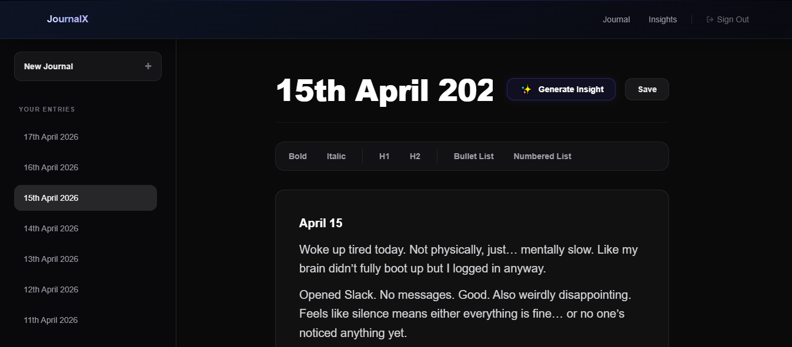
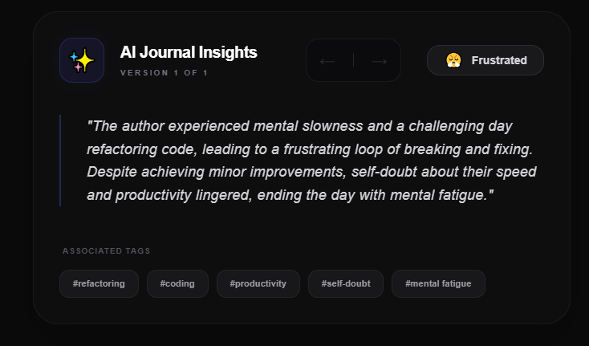
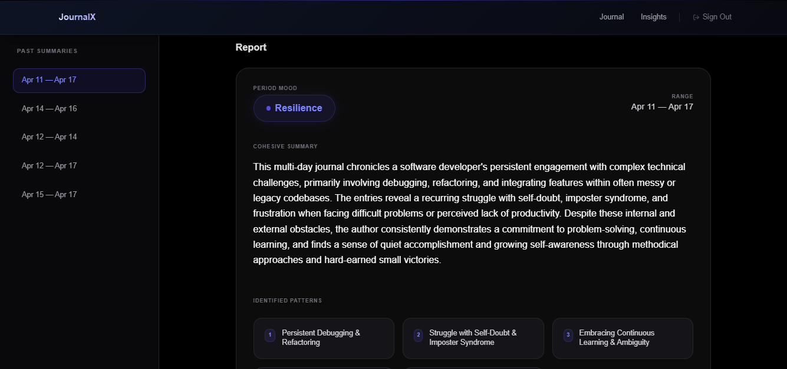

# JournalX 🧠

> Journaling that looks back at you.

<div align="center">
  
</div>

## Overview

JournalX is an AI-powered personal space that transforms raw daily thoughts into actionable psychological insights. While most journaling platforms act as static text graveyards, JournalX actively decodes your entries to identify emotional resonance, summarize days concisely, and surface recurring life patterns, enabling you to track your mental evolution over time.

## Key Features

- ✍️ **Distraction-Free Workspace:** A premium, real-time rich text editor designed for deep focus.
- 🎯 **Daily AI Insights:** Instantly extract the essence of your entries:
  - **Mood:** Single-word emotional labeling.
  - **Digest:** A succinct 2-3 line summary of your day.
  - **Auto-Tagging:** Smart keyword extraction highlighting key topics.
- 🕰️ **Insight History:** Trace how your reflection on past entries changes over time with historical AI generation tracking.
- 🔭 **Big-Picture Analytics:** Generate 3—15 day meta-summaries to identify broader life patterns, habits, and your overarching emotional trend.
- 🔒 **Private Vaults:** Secure, session-based authentication ensuring your thoughts remain strictly yours.
- ⚖️ **Mindful Limits:** A thoughtful 3-insight daily quota designed to encourage meaningful reflection and manage context accurately.

## User Flow

1. **Capture:** Open a clean canvas and document your daily thoughts.
2. **Analyze:** Request an AI breakdown of your entry to instantly extract moods and summaries.
3. **Review:** Visualize your simplified emotional data on a personalized insight card.
4. **Reflect:** Select a custom date range to view a macro-analysis of an entire week or month, identifying hidden triggers and habits.

## Tech Stack

- **Frontend:** Next.js, Tiptap, Framer Motion, Tailwind CSS
- **Backend:** Next.js (Server Components)
- **Database:** MongoDB
- **AI Integrations:** Google Generative AI 

## Getting Started

### Prerequisites

- Node.js installed
- A MongoDB cluster
- A Gemini AI API Key

### Run Locally

1. Clone the repository:
   ```bash
   git clone https://github.com/yourusername/journalx.git
   cd journalx
   ```
2. Install dependencies:
   ```bash
   npm install
   ```
3. Configure your core environment variables in the `.env` file (Database URIs, Session Secrets, AI Keys).
4. Start the development server:
   ```bash
   npm run dev
   ```

## Roadmap

- 🛡️ **End-to-End Encryption:** Total thought security and decentralization.
- 📊 **Advanced Visual Analytics:** Mood-over-time scatter plots and word-count correlation charts.
- 🎙️ **Multi-Media Journaling:** Support for audio capture and visual attachments.

## Product Showcase

### Distraction-Free Workspace
A minimal, premium environment that auto-saves your thoughts and analyzes them in real-time.

<div align="center">
  
</div>
<br/>

### AI-Powered Reflection & Analytics
Extract a single-word mood and a concise summary instantly. Zoom out to see emotional trends and recurring patterns over customized date ranges.

<div align="center">
  
  &nbsp;
  
</div>

---
*Built for growth. Built for clarity.*
